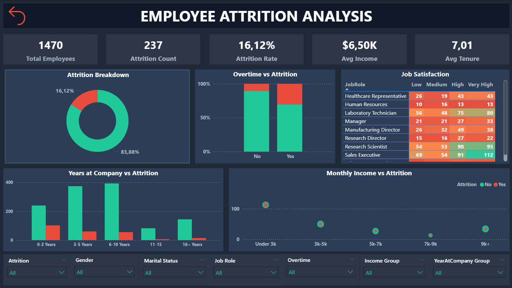

# 📊 HR Employee Attrition Dashboard

## 🖼️ Final Dashboard

---

## 🎯 Dashboard Objective

The goal of this project is to analyze **employee attrition trends** using **SQL, Python (Databricks)**, and **Power BI**.  
The single-page dashboard highlights key drivers of attrition such as department, job satisfaction, work-life balance, income, and tenure, enabling HR teams to improve retention strategies.

---

## 📌 Key Components

- 🧠 **DAX** measures created for KPIs and attrition calculations  
- 📊 **Power BI** dashboard with slicers, filters, and conditional formatting  

---

## 📊 Core Visualizations

| Visual Type             | Purpose                                             |
|-------------------------|-----------------------------------------------------|
| **Donut Chart**         | Overall attrition rate (Yes vs No)                  |
| **100% Stacked Column** | Overtime vs Attrition                               |
| **Matrix**              | Job Satisfaction                                    |
| **Clustered Column**    | Years at Company vs Attrition                       |
| **Scatter Plot**        | Monthly Income vs Attrition                         |
| **Slicers**             | Filters for `Attrition`, `Gender`, `Marital status`, etc.   |
| **Reset Button**        | Clears all selected filters with a single click     |

---

## 💡 Highlighted Insights

- 📉 Overall attrition rate is **16%** (237 of 1470 employees)  
- 🏢 Highest attrition is observed in the **Sales** department  
- 💸 Employees with **lower monthly income** tend to leave more often  
- 🕒 Attrition is highest among employees with **<5 years at the company**  
- ⚖️ Poor **work-life balance** and **low job satisfaction** are strong attrition drivers  

---

## 💼 Business Solutions

- 🎯 Focus retention programs on **Sales department** employees  
- 💰 Review compensation structures for **low-income roles**  
- 🧑‍💼 Enhance **onboarding and career development** for employees in their first 5 years  
- 🕐 Promote **flexible work arrangements** to improve work-life balance  
- 📊 Use satisfaction surveys to track and improve HR policies  

