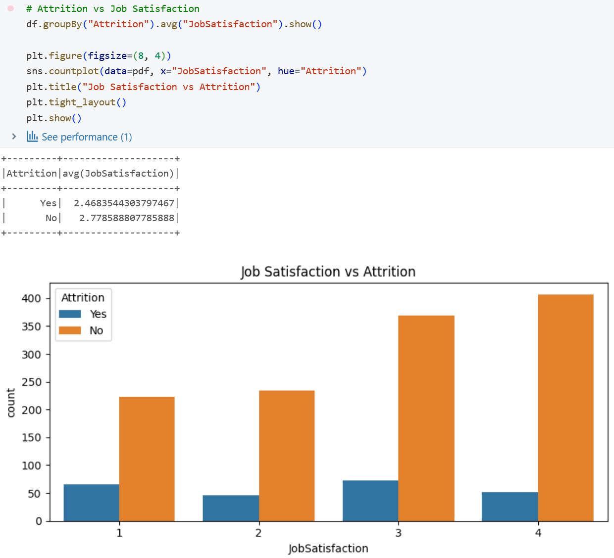
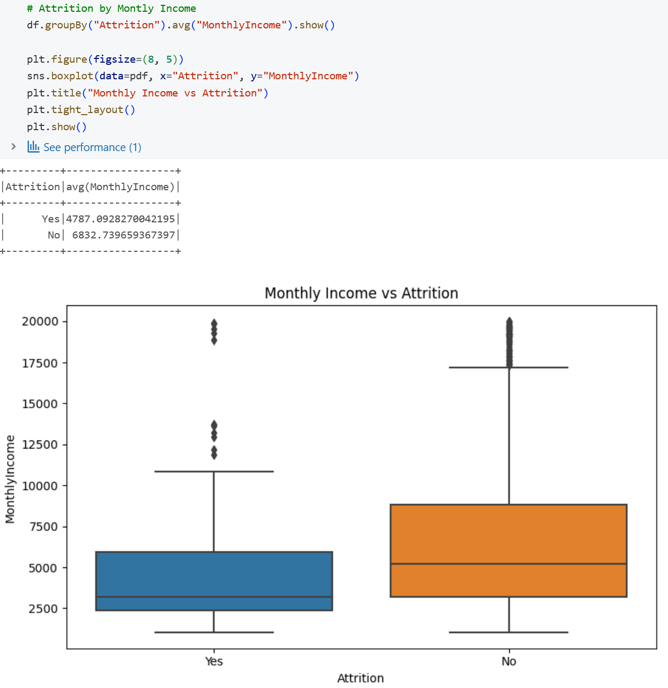
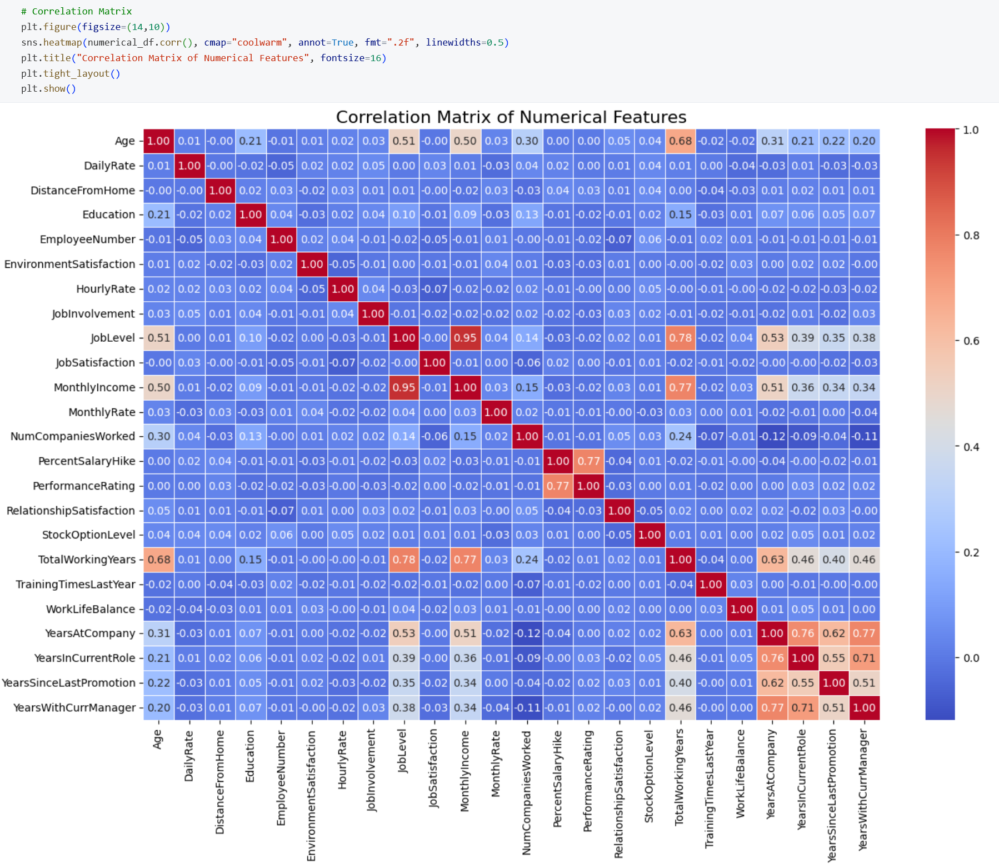
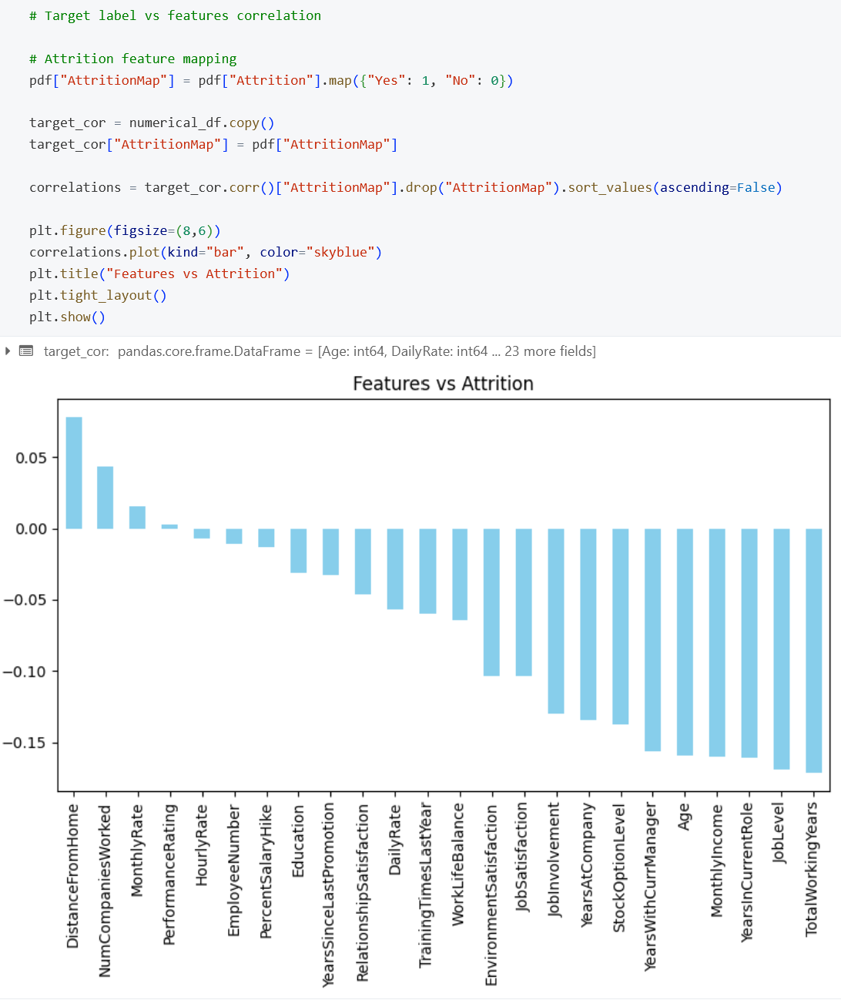

# 🧠 HR Employee Attrition - Python EDA (Databricks)

This notebook performs exploratory data analysis (EDA) on HR employee attrition data using **Databricks and PySpark**. This stage reveals key employee patterns and supports business decisions related to retention and workforce planning.

---

## 🧠 Business Context

The Python EDA stage builds foundational knowledge for identifying what drives attrition. It focuses on the relationship between employee attributes (e.g., income, job satisfaction, overtime) and attrition trends. These insights directly inform Power BI dashboards.

---

## 🔍 EDA Goals

- Understand the structure and quality of the dataset
- Separate and analyze categorical and numerical variables
- Engineer features for tenure and income bands
- Explore relationships between key HR indicators and attrition
- Visualize patterns and identify potential drivers

---

## ⚙️ Tools & Techniques Used

- **Databricks** notebooks with **PySpark** 
- Feature engineering with Spark DataFrames
- Aggregation and grouping 
- Visualizations with **Matplotlib** and **Seaborn**
- Correlation matrix and scatter plots

---

## 📸 Visual Examples

### Attrition vs Job Satisfaction

### Monthly Income vs Attrition (Scatter)

### Correlation Matrix

### Attrition vs Features

---

## 🧹 Output

- Cleaned and transformed Spark DataFrame
- Plots and summaries exported for further reporting

---

## ✅ Next Steps

- Design Power BI dashboard using EDA insights
