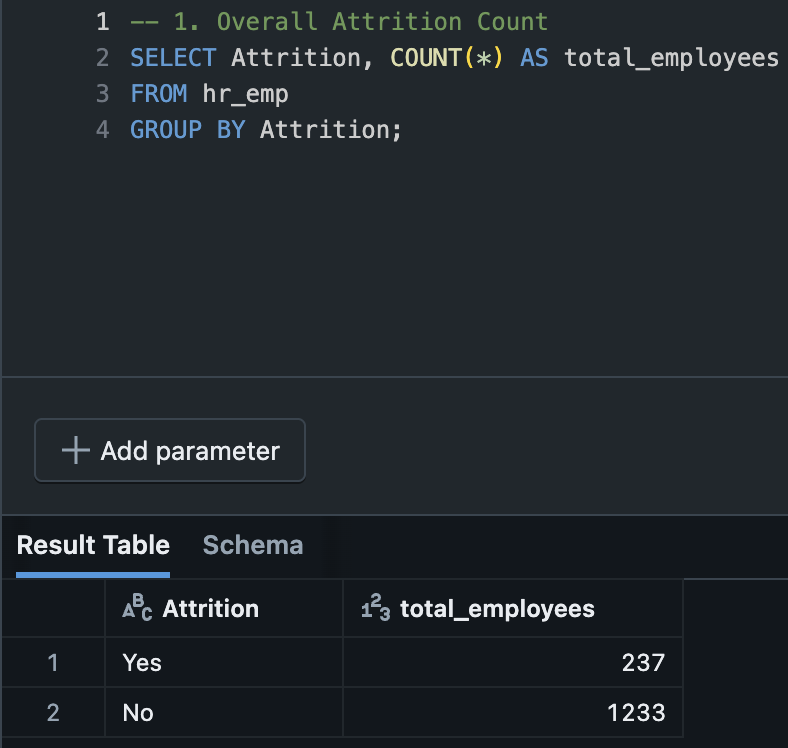
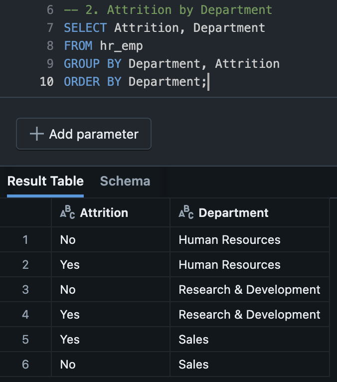
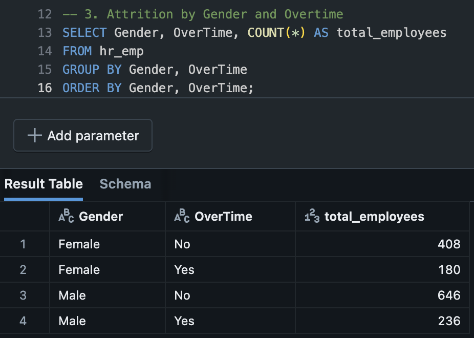
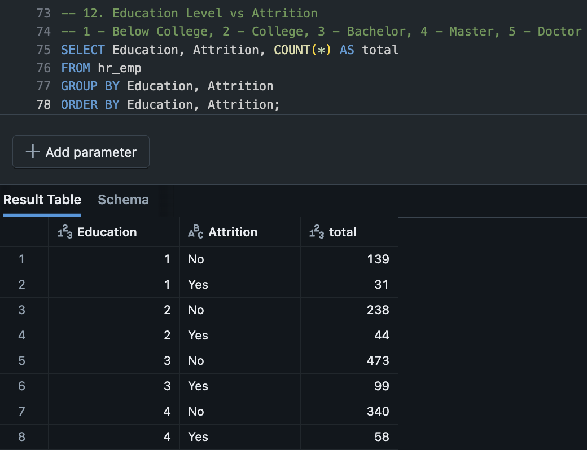
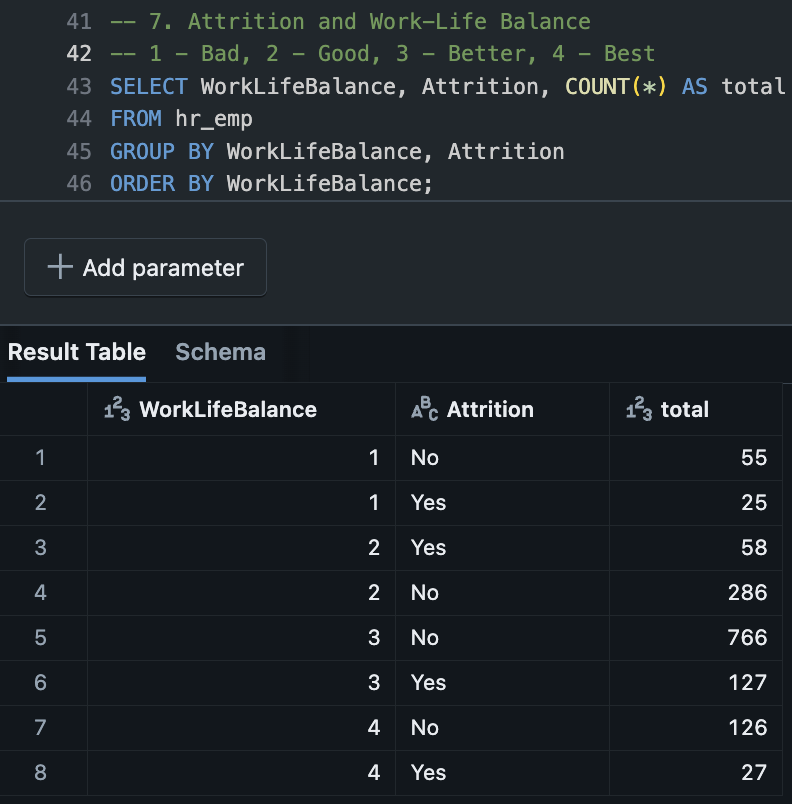
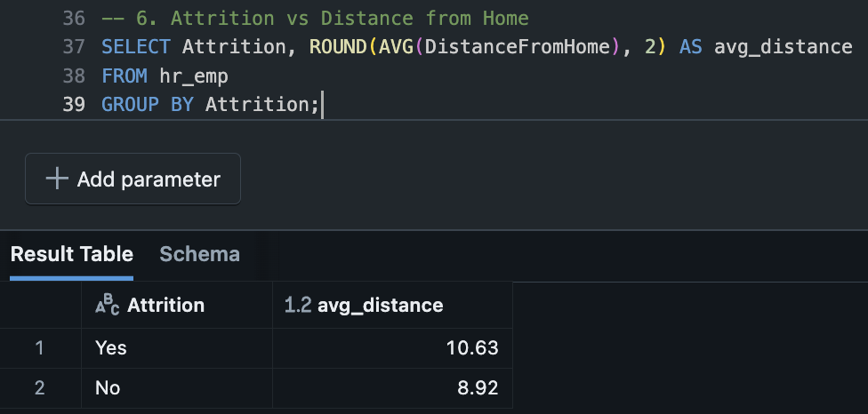

# 🧠 SQL Analysis - HR Employee Attrition

This folder contains SQL queries written to analyze HR employee data with a focus on attrition trends. The goal is to extract meaningful insights that can guide retention strategies, improve work-life balance, and enhance employee satisfaction.

---

## 🎯 Purpose

To answer key HR-related business questions using SQL queries that support strategic decision-making in areas like employee turnover, departmental attrition, and work-life balance.

---

## 📁 Folder Contents

- `hr_attrition_analysis_queries.sql`: Full list of SQL queries with comments
- `images/`: Screenshots of query results and visual outputs
- `README.md`: This documentation file

---

## 🔍 SQL Insights Overview

Below are the key queries and what they inform:

### 1. Overall Attrition Count
> Determine the total number of employees who left vs stayed.

---

### 2. Attrition by Department
> Identify departments with the highest attrition rates.

---

### 3. Attrition by Gender and Overtime
> Understand if gender and overtime impact attrition rates.

---

### 4. Attrition by Education Level
> Examine if education level correlates with attrition.

---

### 5. Attrition by Work-Life Balance
> Reveal the relationship between work-life balance ratings and attrition.

---

### 6. Attrition by Distance From Home
> Analyze whether commuting distance affects attrition.

---

## ✅ Summary

These SQL queries provided early-stage exploratory insights into employee attrition trends across demographics, job conditions, and organizational structure. They support HR decision-making by pinpointing high-risk segments and potential retention levers.
